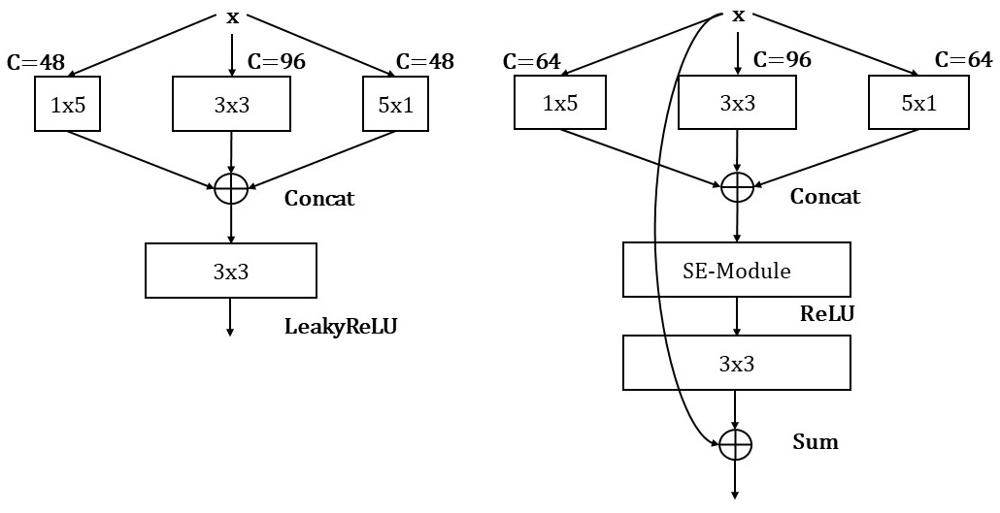
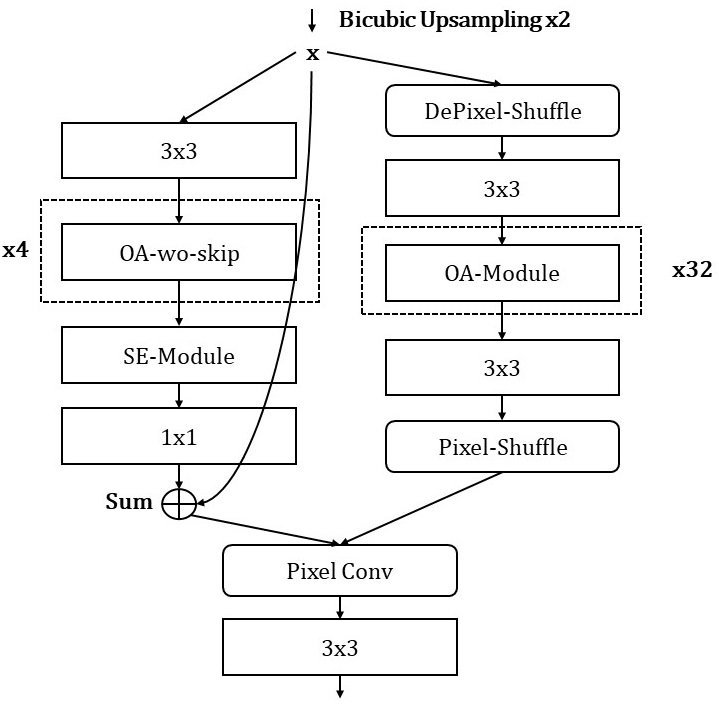
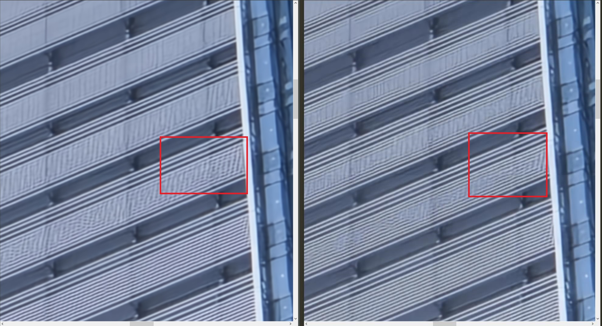
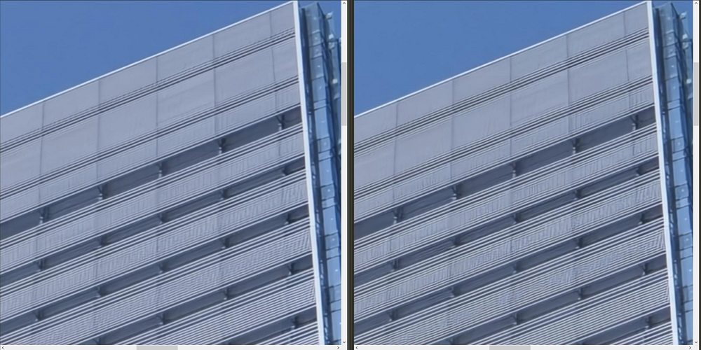
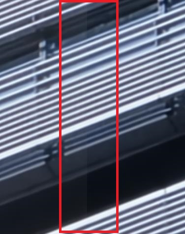
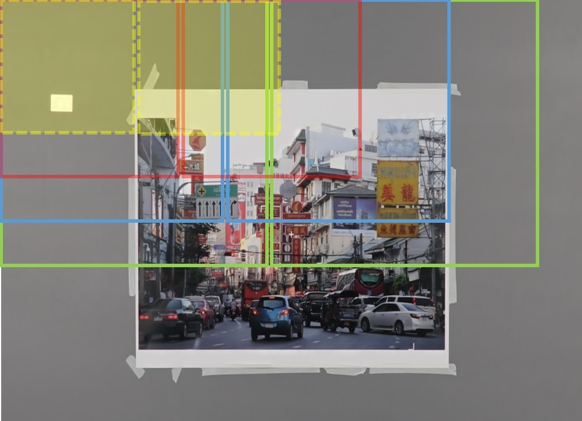

# AIM2020-RealSR (Team AiAiR, Final Rank 4th, SSIM Rank 3rd)
Our solution to AIM2020 Real Image x2 Super-Resolution Challenge (co-organized with ECCV2020). **SSIM Rank 3rd** at the end of the Development phase (2020.7.10). **We propose a new "[crop-ensemble](https://github.com/HolmesShuan/AIM2020-RealSR/blob/master/README.md#51-crop-ensemble)" and it is compatible with model-ensemble and self-ensemble to achieve higher performances.**

## 1. Basic Models :
Our solution consists of four basic models (**model ensemble**): OADDet, Deep-OADDet, original [EDSR](https://github.com/thstkdgus35/EDSR-PyTorch) and original [DRLN](https://github.com/saeed-anwar/DRLN). (further details in [Training Scripts](https://github.com/HolmesShuan/AIM2020-RealSR/blob/master/README.md#33-training-scripts) and [Dataset](https://github.com/HolmesShuan/AIM2020-RealSR/blob/master/README.md#dataset)). 



Our core modules of OADDets are heavily borrowed from [DDet](https://github.com/ykshi/DDet), [Inception](https://arxiv.org/pdf/1409.4842.pdf) and [OANet](https://openaccess.thecvf.com/content_CVPRW_2019/papers/NTIRE/Du_Orientation-Aware_Deep_Neural_Network_for_Real_Image_Super-Resolution_CVPRW_2019_paper.pdf) with minor improvements, such as fewer attention modules, skip connections and LeakyReLU.



## 2. Environment :
We conduct experiments on Nvidia GPUs (NVIDIA Tesla V100 SXM2 16GB x 12). The total training time is about 2000 GPU hours on V100. It takes about 32GB DRAM during training. We have tested our codes in the following environment (**Please install the same version of torch,CUDA,numpy,Pillow,etc. Otherwise the results may differ from ours.**):
```C
# For testing on 2080Ti
DRAM>=32GB
Pillow==7.1.2
GCC==4.8.5
python==3.6.10
torch==1.5.1 # important
torchvision==0.6.0
CUDA==10.2.89
imageio==2.8.0
numpy==1.18.5
opencv-contrib-python==4.3.0.36
scikit-image==0.17.2
scipy==1.5.0
```

## 3. How to use ?
Please first download the pre-trained models and move all of them into `AIM2020-RealSR/experiment` dir. Please unzip downloaded `TestLRX2.zip` to `AIM2020-RealSR/TestLRX2`. Then, run the following scripts in the `AIM2020-RealSR/src` directory.

Model | Download Link | -
------------ | ------------- | ------------- 
OADDet | [Link](https://pan.cstcloud.cn/s/QogthNSWTuo) (code: lriu) | move to `AIM2020-RealSR/experiment/AIM_DDet/model/`
Deep-OADDet | [Link](https://pan.cstcloud.cn/s/CmwQfREEQk) (code: 3g8u) | move to `AIM2020-RealSR/experiment/AIM_WDDet/model/`
EDSR | [Link](https://pan.cstcloud.cn/s/oXcaoOOuQQ) (code: h7a7) | move to `AIM2020-RealSR/experiment/AIM_EDSR/model/`
DRLN | [Link](https://pan.cstcloud.cn/s/vG9WQ0LgRIE) (code: 6fpg) | move to `AIM2020-RealSR/experiment/AIM_DRLN/model/`

### 3.1 Reproduce x2 test dataset results:
```shell
cd ./src
sh reproduce_testset_results.sh
```
Our testset results can be found [here (Google Drive)](https://drive.google.com/file/d/13l4VLD_OtqGGO2U0qZPjm5-U6D-5BJIK/view?usp=sharing). 
##### If you encounter `out of memory` problem, please manually divide the testing dataset (60 images) into several subsets then run our models on each of them separately. E.g.,
```shell
# subset1 contains 000-019.png
CUDA_VISIBLE_DEVICES=0,1 python main.py --model WDDet --n_resblocks 40 --n_feats 128 --res_scale 1.0 --data_test Demo --scale 2 --save AIM_WDDet_x2_TEST --test_only --dir_demo ../TestLRX2/TestLR_PART1 --pre_train ../experiment/AIM_WDDet/model/AIM_WDDET_X2.pt --n_GPUs 2 --chop --chop-size 450 450 450 450 --shave-size 80 80 10 10 --save_results
# subset2 contains 020-039.png
CUDA_VISIBLE_DEVICES=0,1 python main.py --model WDDet --n_resblocks 40 --n_feats 128 --res_scale 1.0 --data_test Demo --scale 2 --save AIM_WDDet_x2_TEST --test_only --dir_demo ../TestLRX2/TestLR_PART2 --pre_train ../experiment/AIM_WDDet/model/AIM_WDDET_X2.pt --n_GPUs 2 --chop --chop-size 450 450 450 450 --shave-size 80 80 10 10 --save_results
# subset3 contains 040-059.png
CUDA_VISIBLE_DEVICES=0,1 python main.py --model WDDet --n_resblocks 40 --n_feats 128 --res_scale 1.0 --data_test Demo --scale 2 --save AIM_WDDet_x2_TEST --test_only --dir_demo ../TestLRX2/TestLR_PART3 --pre_train ../experiment/AIM_WDDet/model/AIM_WDDET_X2.pt --n_GPUs 2 --chop --chop-size 450 450 450 450 --shave-size 80 80 10 10 --save_results
```

### 3.2 Test on your own images:
```shell
CUDA_VISIBLE_DEVICES=0,1 python main.py --model DDDet --n_resblocks 32 --n_feats 128 --res_scale 1.0 --data_test Demo --scale 2 --save Demo_x2_ouptut --test_only --save_results --dir_demo /your/image/dir/ --pre_train ../experiment/AIM_DDet/model/AIM_DDET_X2.pt --n_GPUs 2 --chop --chop-size 500 --shave-size 100
```
For better results, you are encouraged to use self-ensemble and crop-ensemble to enhance SR images. 
```shell
CUDA_VISIBLE_DEVICES=0,1 python main.py --model DDDet --n_resblocks 32 --n_feats 128 --res_scale 1.0 --data_test Demo --scale 2 --save Demo_x2_ouptut --test_only --save_results --dir_demo /your/image/dir/ --pre_train ../experiment/AIM_DDet/model/AIM_DDET_X2.pt --n_GPUs 2 --chop --chop-size 600 600 300 300 --shave-size 100 10 10 100 --self_ensemble
```

### 3.3 Training Scripts:
We release all our training scripts to help reproduce our results and hopefully, the following methods may benefit from our works.
#### 3.3.1 OADDet (16.5M)
Trained on original AIM x2 dataset; Finetuned on washed AIM x2.
```shell
CUDA_VISIBLE_DEVICES=0,1,2,3 python main.py --model DDDet --scale 2 --save DIV2K_DDet_x2 --n_resblocks 32 --n_feats 128 --res_scale 1.0 --data_train DIV2K --data_test DIV2K --batch_size 32 --dir_data /data/ --ext bin --n_GPUs 4 --reset --patch_size 96 --n_threads 4 --split_batch 1 --lr 1e-4 --decay 100-200 --epochs 300
CUDA_VISIBLE_DEVICES=0,1,2,3 python main.py --model DDDet --scale 2 --save AIM_DDet_x2 --n_resblocks 32 --n_feats 128 --res_scale 1.0 --data_train AIM --data_test AIM --batch_size 32 --dir_data /data/ --ext bin --n_GPUs 4 --reset --patch_size 128 --n_threads 2 --split_batch 1 --lr 5e-5 --decay 150-300-450-600 --epochs 600 --pre_train ../experiment/DIV2K_DDet_x2/model/model_best.pt --save_models --chop
CUDA_VISIBLE_DEVICES=0,1,2,3 python main.py --model DDDet --scale 2 --save AIM_DDet_x2_SSIM_finetune --n_resblocks 32 --n_feats 128 --res_scale 1.0 --data_train AIM --data_test AIM --batch_size 4 --dir_data /data/AIM_washed --ext bin --n_GPUs 4 --reset --patch_size 420 --n_threads 4 --split_batch 1 --lr 1e-6 --decay 100 --epochs 100 --pre_train ../experiment/AIM_DDet_x2/model/model_latest.pt --chop --loss 20.0*SSIM
```

#### 3.3.2 Deep-OADDet (21.9M)
Trained on washed AIM x2 dataset; Fine-tuned on washed AIM x2+x3 dataset and washed x2 dataset.
```shell
CUDA_VISIBLE_DEVICES=0,1,2,3 python main.py --model WDDet --scale 2 --save DIV2K_WDDet_x2 --n_resblocks 40 --n_feats 128 --res_scale 1.0 --data_train DIV2K --data_test DIV2K --batch_size 32 --dir_data /data/ --ext bin --n_GPUs 4 --reset --patch_size 96 --n_threads 4 --split_batch 1 --lr 1e-4 --decay 30 --epochs 30
CUDA_VISIBLE_DEVICES=0,1,2,3 python main.py --model WDDet --scale 2 --save AIM_WDDet_x2 --n_resblocks 40 --n_feats 128 --res_scale 1.0 --data_train AIM --data_test AIM --batch_size 32 --dir_data /data/AIM_washed --ext bin --n_GPUs 4 --reset --patch_size 128 --n_threads 2 --split_batch 1 --lr 5e-5 --decay 100-200-300 --epochs 350 --pre_train ../experiment/DIV2K_WDDet_x2/model/model_best.pt --save_models --chop
CUDA_VISIBLE_DEVICES=0,1,2,3 python main.py --model WDDet --scale 2 --save AIM_WDDet_x2_L1_finetune --n_resblocks 40 --n_feats 128 --res_scale 1.0 --data_train AIM --data_test AIM --batch_size 32 --dir_data /data/AIM_washed_Large --ext bin --n_GPUs 4 --reset --patch_size 128 --n_threads 4 --split_batch 1 --lr 5e-5 --decay 100-200-300 --epochs 350 --pre_train ../experiment/AIM_WDDet_x2/model/model_latest.pt --chop --loss 1.0*L1
CUDA_VISIBLE_DEVICES=0,1,2,3 python main.py --model WDDet --scale 2 --save AIM_WDDet_x2_SSIM_finetune --n_resblocks 40 --n_feats 128 --res_scale 1.0 --data_train AIM --data_test AIM --batch_size 4 --dir_data /data/AIM_washed --ext bin --n_GPUs 4 --reset --patch_size 400 --n_threads 4 --split_batch 1 --lr 1e-5 --decay 100 --epochs 100 --pre_train ../experiment/AIM_WDDet_x2_L1_finetune/model/model_latest.pt --chop --loss 20.0*SSIM
```

#### 3.3.3 EDSR (40.37M)
Pre-trained EDSR model is used to train on washed AIM x2 dataset; Fine-tuned on washed AIM x2 dataset.
```shell
CUDA_VISIBLE_DEVICES=0,1,2,3 python main.py --template EDSR--pre_train ../../pre_train/edsr_x2.pt --save AIM_EDSR_X2 --data_train AIM --data_test AIM --n_GPUs 4 --batch_size 24 --patch_size 128 --scale 2 --decay 150 --lr 1e-4 --loss 1*L1 --epoch 300
CUDA_VISIBLE_DEVICES=0,1,2,3 python main.py --template EDSR--pre_train ../experiment/AIM_EDSR_X2/model/model_best_2.pt --save AIM_EDSR_X2_finetune --data_train AIM --data_test AIM --n_GPUs 4 --batch_size 16 --patch_size 200 --scale 2 --decay 150 --lr 1e-5 --loss 1*L1 --epoch 300
CUDA_VISIBLE_DEVICES=0,1,2,3 python main.py --template EDSR--pre_train ../experiment/AIM_EDSR_X2_finetune /model/model_best_2.pt --save AIM_EDSR_X2_finetune --data_train AIM --data_test AIM --n_GPUs 4 --batch_size 16 --patch_size 200 --scale 2 --decay 150 --lr 1e-6 --loss 1*L1 --epoch 300
CUDA_VISIBLE_DEVICES=0,1,2,3 python main.py --template EDSR--pre_train ../experiment/AIM_EDSR_X2_finetune /model/model_best_2.pt --save AIM_EDSR_X2_finetune --data_train AIM --data_test AIM --n_GPUs 4 --batch_size 16 --patch_size 200 --scale 2 --decay 150 --lr 1e-7 --loss 1*L1 --epoch 100
```

#### 3.3.4 DRLN (34.43M)
Pre-trained DRLN model is used to train on washed AIM x2 dataset; Fine-tuned on washed AIM x2 dataset.
```shell
CUDA_VISIBLE_DEVICES=0,1,2,3 python main.py --model DRLN--pre_train ../../pre_train/drln_x2.pt --save AIM_DRLN_X2 --data_train AIM --data_test AIM --n_GPUs 4 --batch_size 24 --patch_size 128 --scale 2 --decay 150 --lr 1e-4 --loss 1*L1 --epoch 300
CUDA_VISIBLE_DEVICES=0,1,2,3 python main.py --model DRLN--pre_train ../experiment/AIM_DRLN_X2 /model/model_best_2.pt --save AIM_DRLN_X2_finetune --data_train AIM --data_test AIM --n_GPUs 4 --batch_size 16 --patch_size 200 --scale 2 --decay 150 --lr 1e-5 --loss 1*L1 --epoch 300
CUDA_VISIBLE_DEVICES=0,1,2,3 python main.py --model DRLN--pre_train ../experiment/AIM_DRLN_X2_finetune /model/model_best_2.pt --save AIM_DRLN_X2_finetune --data_train AIM --data_test AIM --n_GPUs 4 --batch_size 16 --patch_size 200 --scale 2 --decay 150 --lr 1e-6 --loss 1*L1 --epoch 300
CUDA_VISIBLE_DEVICES=0,1,2,3 python main.py --model DRLN --pre_train ../experiment/AIM_DRLN_X2_finetune /model/model_best_2.pt --save AIM_DRLN_X2_finetune --data_train AIM --data_test AIM --n_GPUs 4 --batch_size 16 --patch_size 200 --scale 2 --decay 150 --lr 1e-7 --loss 1*L1 --epoch 100
```

## 4. Dataset :
### 4.1 Washed Dataset :
According to this [issue](https://competitions.codalab.org/forums/21376/3953/):
> I found that many photos in the training dataset are not pixel-wise aligned. Actually, there are different types of misalignment: camera shift, moving objects (e.x. trees, grass).

> However, looking at the dataset, I found that there are very large shifts in some crops. For example, 000012, 000016, 000018, 000021.
There is also a colour mismatch sometimes between LR and HR: for example 000022.

it seems that the official dataset is unsatisfactory. Therefore, we manually washed x2/x3/x4 datasets to obtain three subsets. There are about 300 damaged image pairs in each original dataset. The washed datasets are now publicly available:

Original Dataset | Original number of images | Ours | Clean Image ID Download Link
------------ | ------------- | ------------- |  ------------
[x2](https://1drv.ms/u/s!AtE0puUOX2nNgW9bGUzZtoRksxwP?e=dP5yMD) | 19000 | 18475 | [Link](https://github.com/HolmesShuan/AIM2020-RealSR/blob/master/washed_dataset/x2_clean_img_id.txt)
[x3](https://1drv.ms/u/s!AtE0puUOX2nNgXA8gJT6YRTBhY7x?e=edRCqz) | 19000 | 18643 | [Link](https://github.com/HolmesShuan/AIM2020-RealSR/blob/master/washed_dataset/x3_clean_img_id.txt)
[x4](https://1drv.ms/u/s!AtE0puUOX2nNgXHMsFe8G9MbbmQR?e=khQcNg) | 19000 | 18652 | [Link](https://github.com/HolmesShuan/AIM2020-RealSR/blob/master/washed_dataset/x4_clean_img_id.txt)

### 4.2 Washed x2+x3 Dataset (AIM_washed_Large) :
Though AIM2020 x2 dataset contains 19K real LR/HR pairs, our models still suffer from overfishing. In light of this, we use x3 LR/HR pairs to fine-tune x2 models. Specifically, we downsample x3 HR images to x2 size (i.e., `HR_img.resize(H//3*2, W//3*2)`), which generates a larger AIM x2 dataset with 37118 images, namely `AIM_washed_Large`. 

This setting contributes to better visualization results on hard samples. Left subfigure is only trained on x2 washed and right subfigure is trained on x2+x3. However, this training strategy results in a chromatism problem. 



### 4.3 ClipL1 Loss :
To solve the noisy data problem, we propose a new loss function for CNN-based low-level computer vision tasks. As the name implies, ClipL1 Loss combines Clip function and L1 loss. `self.clip_min` sets the gradients of well-trained pixels to zeros and `clip_max` works as a noise filter. 
```python
import torch
import torch.nn as nn

class ClipL1(nn.Module):
    # data range [0, 255], for [0,1] please set clip_min to 1/255=0.003921.
    def __init__(self, clip_min=1.0, clip_max=10.0):
        super(ClipL1, self).__init__()
        self.clip_max = clip_max
        self.clip_min = clip_min

    def forward(self, sr, hr):
        loss = torch.mean(torch.clamp(torch.abs(sr-hr), self.clip_min, self.clip_max))
        return loss
```

## 5. Model Ensemble :
To alleviate the chromatism problem, we use self-ensemble and model ensemble at inference time. Left subfigure is ensembled and right subfigure is a single model baseline.



### 5.1 Crop-ensemble

We further propose a new ensemble method called `crop-ensemble`. The motivation is to hide the seam artifact caused by cropping input images:



Please refer to `model/__init__.py` Line59 for more information. Different colors of boxes indicate different crop sizes. Small boxes cover the seams between predicted large image patches and vice versa. In our experiments, **crop-ensemble noticeably improves the performance and the more the better!**   



Here we list several recommendations:
```python
--chop-size 600 600 600 600 --shave-size 100 100 10 10
--chop-size 600 300 --shave-size 100 100
--chop-size 600 300 300 600 --shave-size 100 100 10 10
```

## 6. Acknowledgement :
We would like to thank [EDSR](https://github.com/thstkdgus35/EDSR-PyTorch), [DRLN](https://github.com/saeed-anwar/DRLN), [DDet](https://github.com/ykshi/DDet), [Pytorch-ssim](https://github.com/Po-Hsun-Su/pytorch-ssim), [CBAM](https://github.com/Jongchan/attention-module), [CGD](https://github.com/HolmesShuan/Compact-Global-Descriptor) and [RealSR](https://github.com/Alan-xw/RealSR) for sharing their codes. Our methods are built on those inspiring works. We still borrow some ideas from [NTIRE2019](https://openaccess.thecvf.com/CVPR2019_workshops/CVPR2019_NTIRE) leading methods, such as [OANet](https://openaccess.thecvf.com/content_CVPRW_2019/papers/NTIRE/Du_Orientation-Aware_Deep_Neural_Network_for_Real_Image_Super-Resolution_CVPRW_2019_paper.pdf) and [KPN](https://github.com/csjcai/RealSR). We appreciate the tremendous efforts of previous methods. 

## 7. Cite :
If you find this repository useful, please cite:
```
@misc{AIM2020RealSR,
  author = {Xiangyu He},
  title = {AIM2020-RealSR},
  year = {2020},
  publisher = {GitHub},
  journal = {GitHub repository},
  howpublished = {\url{https://github.com/HolmesShuan/AIM2020-RealSR}},
}
```
